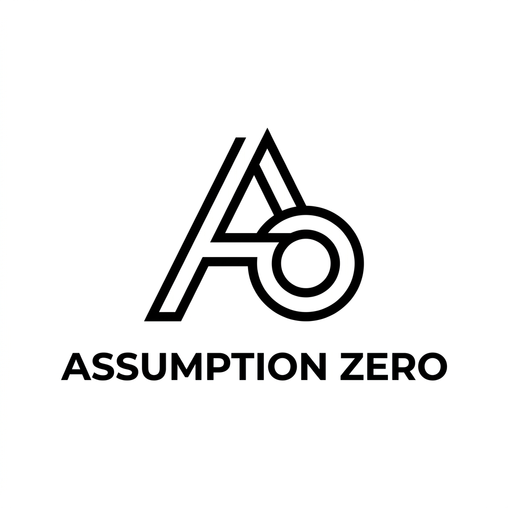
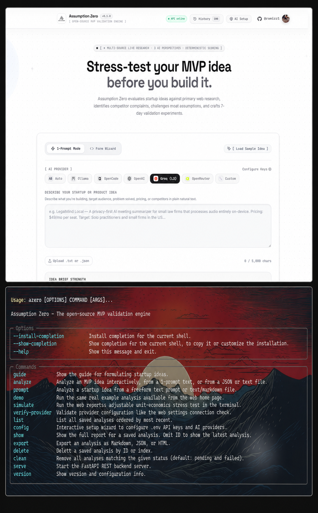
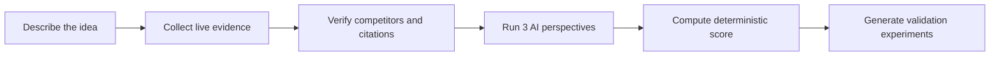

<div align="center">
  <a href="https://github.com/ramizz1/assumption-zero">
    
  </a>

  <h1>Assumption Zero</h1>

  <p><strong>Evidence-first startup validation for founders who would rather learn than guess.</strong></p>
  <p>Discover real competitors, challenge the riskiest assumptions, score the opportunity, and leave with experiments you can run before building.</p>

  <p>
    <a href="https://github.com/ramizz1/assumption-zero/actions/workflows/ci.yml"></a>
    <a href="LICENSE"></a>
    
    
    
  </p>

  <p>
    <a href="#quick-start"><strong>Quick start</strong></a> ·
    <a href="#how-it-works"><strong>How it works</strong></a> ·
    <a href="#cli--web-parity"><strong>CLI</strong></a> ·
    <a href="#opportunity-score"><strong>Scoring</strong></a> ·
    <a href="CONTRIBUTING.md"><strong>Contribute</strong></a>
  </p>
</div>

<p align="center">
  
</p>

<p align="center"><sub>The real web and CLI interfaces. Both use the same analysis engine and shared history.</sub></p>

> [!IMPORTANT]
> Assumption Zero is decision support—not a prediction, investment recommendation, or substitute for speaking with customers. Claims are grounded in collected evidence and uncertainty remains visible.

## Why Assumption Zero?

Most idea validators turn a polished prompt into a polished opinion. Assumption Zero separates the jobs:

- **Research providers collect evidence** from the live web, news, arXiv, GitHub, Hacker News, Reddit, and Wikipedia.
- **AI perspectives interpret the evidence** as a market analyst, skeptical investor, and practical builder.
- **Python computes the score** with explicit weights instead of asking a model to invent one.
- **Citation validation rejects unsupported claims** and competitor candidates that are not backed by their cited evidence.
- **Experiments turn uncertainty into action** with success criteria, failure criteria, cost, and time estimates.

### What you get

| Output | What it answers |
|---|---|
| Evidence-backed competitor map | Who already solves this problem, and how directly? |
| Opportunity Score | How strong is the opportunity across seven inspectable dimensions? |
| Three independent perspectives | What would an analyst, investor, and builder challenge? |
| Unit-economics stress test | What happens when price, CAC, cost, or churn changes? |
| Validation experiments | What is the cheapest useful test to run next? |
| Exportable report | How can the evidence and decision be shared with a team? |

## How it works



The engine preserves the evidence trail throughout the report, so a reader can distinguish a sourced claim from an inference and an inference from a missing signal.

## Quick start

### Requirements

- Python 3.12+
- Node.js 20+ for the web interface
- An AI-provider key is optional; without one, Assumption Zero runs its labeled deterministic baseline over collected evidence

### 1. Install the engine

```bash
git clone https://github.com/ramizz1/assumption-zero.git
cd assumption-zero/backend
python -m venv .venv
```

Activate the environment:

```cmd
# Windows 
.venv\Scripts\activate.bat && pip install -e ".[dev]"
```

```bash
# macOS / Linux
source .venv/bin/activate
pip install -e ".[dev]"
```

### 2. Run your first analysis

```bash
azero config
azero demo
```

Or start with your own idea:

```bash
azero prompt "A privacy-first AI meeting summarizer for small law firms"
```

### 3. Launch the web interface

Terminal one:

```bash
cd backend
.venv/Scripts/uvicorn assumption_zero.main:app --reload --port 8000
```

On macOS or Linux, use `.venv/bin/uvicorn` instead.

Terminal two:

```bash
cd frontend
npm ci
npm run dev
```

Open [http://localhost:5173](http://localhost:5173).

> [!TIP]
> If Windows reports `WinError 10013` on port 8000, another process or Windows port reservation is blocking it. Try `--port 8010`, then set `VITE_API_BASE_URL=http://localhost:8010` for the frontend.

## AI providers

Use `azero config` for the interactive setup. Supported configurations include OpenRouter, Groq, OpenAI-compatible endpoints, OpenCode, Ollama, and the no-key deterministic baseline.

```bash
azero verify-provider openrouter --api-key sk-or-v1-your-key
azero analyze --provider ollama --model llama3.1
```

Keep secrets in your local `.env`; never commit API keys. See [.env.example](.env.example) for available settings.

## CLI + Web parity

Both interfaces use the same engine and the same root `azero_data` history. An analysis started in either interface appears in both `azero list` and the web **History** view.

| Goal | CLI |
|---|---|
| Configure AI providers | `azero config` |
| Run a guided example | `azero demo` |
| Analyze natural language | `azero prompt "your idea"` |
| Analyze structured input | `azero analyze --file examples/sample-idea.json` |
| Choose research sources | `azero analyze -r "Web Search" -r GitHub` |
| Inspect saved work | `azero list` / `azero show 1` |
| Stress-test economics | `azero simulate 1 --cac 120 --churn 4` |
| Export a report | `azero export 1 --format markdown --output report.md` |
| Verify provider settings | `azero verify-provider openrouter` |

Run `azero --help` or `azero <command> --help` for every option.

## Opportunity Score

The Opportunity Score is deterministic and inspectable:

| Dimension | Weight | Signal |
|---|---:|---|
| Problem Evidence | 20% | Customer pain and current workarounds |
| Demand Signals | 20% | Market activity and purchase intent |
| Competitive Gap | 15% | Differentiation and market saturation |
| Distribution Feasibility | 15% | Reachability and likely acquisition efficiency |
| Unit Economics | 15% | Margin, pricing, payback, and retention assumptions |
| Founder / Project Fit | 10% | Skills, runway, and execution fit |
| Legal & Operational Risk | 5% | Compliance, privacy, and operational exposure |

AI does not directly choose the final score. It produces structured evidence-aware analysis; the scoring engine applies explicit rules and weights.

## Research and accuracy model

Assumption Zero treats model output as a candidate—not a fact:

1. Research providers collect and normalize evidence.
2. AI responses cite evidence IDs from that collection.
3. Citation validation rejects missing or fabricated references.
4. Discovered competitors are accepted only when their cited evidence supports the name.
5. Conflicts, gaps, confidence, and missing information remain visible in the report.

This design reduces hallucination risk, but it cannot eliminate incomplete search results, stale source material, provider errors, or ambiguous evidence.

## Architecture

```text
assumption-zero/
├── backend/
│   ├── assumption_zero/
│   │   ├── analysis/       # orchestration, scoring, citation validation
│   │   ├── api/            # FastAPI endpoints
│   │   ├── llm/            # model adapters and structured responses
│   │   ├── research/       # live evidence providers
│   │   └── cli.py          # Typer CLI
│   └── tests/
├── frontend/
│   └── src/                # React, TypeScript, reports, simulators
├── docs/assets/            # repository media
├── examples/
└── .github/workflows/      # continuous integration
```

## Development

Run the backend suite:

```bash
cd backend
.venv/Scripts/python -m pytest -q
```

Run the frontend quality gate:

```bash
cd frontend
npm run check
```

## Deploy safely

Before exposing Assumption Zero publicly:

- Serve it over HTTPS because users may supply their own provider keys.
- Set `SSRF_PROTECTION_ENABLED=true` for custom provider URLs.
- Restrict `CORS_ORIGINS` to the real frontend origin.
- Add rate limiting at the proxy or hosting layer.
- Persist `azero_data` on a protected volume and define a retention policy.
- Keep `.env` and generated private reports out of version control.

See [SECURITY.md](SECURITY.md) for vulnerability reporting.

## Contributing

Contributions that improve evidence quality, research coverage, scoring transparency, provider support, accessibility, or founder workflows are welcome. Start with [CONTRIBUTING.md](CONTRIBUTING.md), or open a feature request if you want to discuss an idea first.

## Repository artwork

The GitHub-ready social preview is available at [docs/assets/social-preview.jpg](docs/assets/social-preview.jpg). It is **1280×640**, uses a solid background, and is under 1 MB as recommended by GitHub.

## License

Released under the [MIT License](LICENSE).

<div align="center">
  <p><strong>If Assumption Zero helps you avoid building the wrong thing, consider starring the repository.</strong></p>
  <a href="https://github.com/ramizz1/assumption-zero">⭐ Star Assumption Zero</a>
</div>
